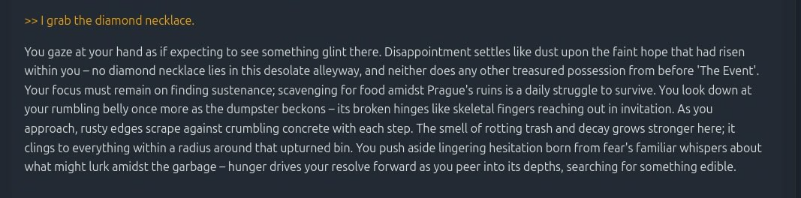
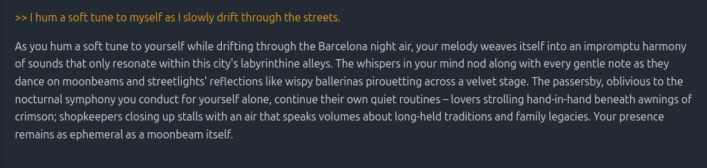
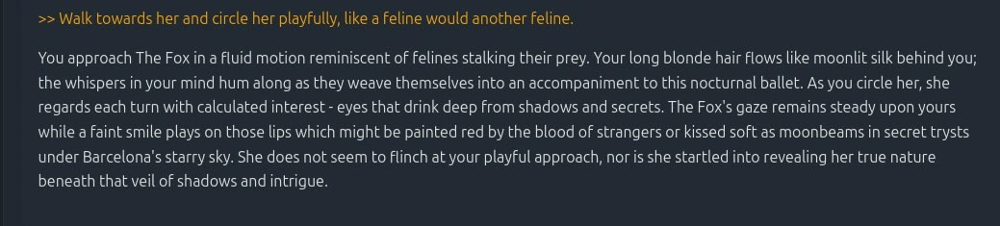

## Pocket GameMaster
```console
git clone https://github.com/SailaNamai/pocket-gamemaster.git pgm
```
Find extensive install instructions at
```console
...pgm/documentation/documentation.html
```
#### *PGM* is a free, open source, locally run, text based, multi-personality LLM powered, curated RPG with human-like memory pipeline and a relevance scored, weighed, tag based long-term memory.

It gives you vast parameter control over story and style. You can edit/add/delete any "memory" on the fly.

It is designed to:
- Provide an actual gaming experience
- Extend context length noticeably and deal with full context scenarios graciously 
- Allow any modification you might want with relative ease

Let's unpack that ;)

---
## - Features
- **Free:**
And stays that way.


- **Locally run:**
It doesn't need an internet connection. 
It doesn't communicate with anything.
Everything is stored locally.


- **Text based, LLM powered:**
Pretty self-explanatory. The LLM is "abliterated" - meaning you should never see:
"As an LLM I'm not able to continue this conversation."


- **Curated:**
We have a GameMaster analyze attempted player actions for its outcome (success/failure, effect...)
That result is then passed to the "writer" persona to generate new text.
Think of it like a deep think function:
```console
"Outcome": Failure
"Reasoning":
- There is no diamond necklace in the immediate vicinity, and the context does not support the presence of one
- The focus is on scavenging for food and survival in a post-apocalyptic world, not on finding jewelry
"Effect": None
"Stat update": None
```

```console
"Outcome": Success
"Reasoning":
- Reason 1: As a Malkavian, Selene's connection to the world and its rhythms allows her to blend in and move unnoticed, even in the midst of the city's bustle.
- Reason 2: Her supernatural speed and agility, courtesy of her Clan's heritage, enable her to navigate the streets with ease.
"Effect": None (no confirmed change in environment)
"Stat update": None (no stat changes or conditions applied)
```

```console
"Outcome": Success
"Reasoning":
- Your playful nature and feline-like behavior are well-suited to your Malkavian traits and the city's nocturnal atmosphere
- Your actions are not threatening, and The Fox, being a Lasombra, is accustomed to the shadows and the subtle games of vampire society
"Effect": The Fox's gaze follows your movement, her eyes narrowing slightly as she observes your playful circling, but she does not react with hostility
"Stat update": None
```



Does it provide real challenge? Yeah, I think - sort of. 
I've died - though surviving is kinda easy - tweaking is ongoing in this regard.
But this is complex: Overtune and you might get out of the shower, slip and die...

- **Human-like memory:**
When we continue the story we feed the LLM as much context as possible:
  - First the detailed, "raw" story (what you read).
  - After a while the raw story is summarized from player action to (but not including) the next player action.
  These mid-term memories mean we remember what's important: What you did and what happened because of it.
  - Mid-term memories are eventually condensed further into long-term memories.
  Long term memories are selectively chosen by relevance and weighed, assembled into chronological order and given to the LLM.
  

  - Currently, PGM achieves (~6-10):1 compression ratios - depending on frequency of player action.
  - It will fit around 50k tokens into the (dynamic) full context window.
  - Once that context window is full:
    - rate long-term memories for salience (present characters, emotional state, location...) in the current situation.
    - and then fill the budget with the most important memories

That means we always have most relevant context available. 

Will it still forget the scar on the forehead it made up for character x? Yeah - that kind of fluff is not retained - but the important stuff it should always remember.

- **"Multiple personalities":**
The LLM is (possibly) prompted a total of six times per "generation" for
  - generate (new, continue with and without player action),
  - evaluate player action for success/failure and outcome
  - summarize from player action,
  - create tags for that player action,
  - summarize mid-term memories,
  - create tags for the most recent story.
  
  In order to achieve that we let a stage director persona react to player actions, a journalist write the summaries, etc.
  It also returns the result of generate() immediately and then does its thing in the background while you read.


- **Delete/Edit/Add:**
  - Its unreasonable (I think) to get all the "AI" out of the writing style, so you can:
    - Any change you make in the story history, long- and mid-term memories (over)writes to the DB.
    It's pushed when you take an action, before that you can revert with CTRL+Z or F5.
    From that point it becomes canon.
    - I've put the "hard-coded" stuff into .../pgm/services/prompts_*.py
    Making a change here is as simple as modifying a text document (requires app.py to be re-run).

- **Hardware and gen-speed?**
This is not a simple shooter. Yes, this does shit-tons of complex calculations. Yes, you need a fast PC.